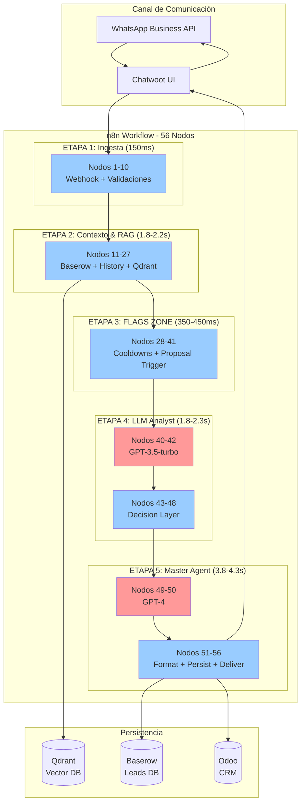

# Sales Agent WhatsApp - Documentación Completa

**Versión**: 1.0
**Fecha**: 2025-10-31
**Total de nodos**: 56
**Autor**: Leonobitech Engineering Team

---

## 🚀 Inicio Rápido

Si es tu primera vez aquí, **empieza por estos documentos en orden**:

1. **[WORKFLOW-COMPLETO-RESUMEN.md](WORKFLOW-COMPLETO-RESUMEN.md)** - Visión general del sistema completo (15 min lectura)
2. **[Arquitectura Visual](#arquitectura-visual)** - Diagrama interactivo (2 min)
3. **Resúmenes por ETAPA** - Profundiza en cada sección (5-10 min cada uno)

---

## 📊 Arquitectura Visual

**Leyenda**:
- 🔴 **Nodos rojos**: LLM calls (cuellos de botella, 70% del tiempo total)
- 🔵 **Nodos azules**: Procesamiento de código (rápido, 30% del tiempo)

---

## 📚 Resúmenes Ejecutivos

### Empezar Aquí 👇

| Documento | Descripción | Tiempo Lectura | Nodos |
|-----------|-------------|----------------|-------|
| **[WORKFLOW-COMPLETO-RESUMEN.md](WORKFLOW-COMPLETO-RESUMEN.md)** | 🌟 Overview completo del sistema (56 nodos) | 15 min | 1-56 |

### Resúmenes por ETAPA

| ETAPA | Documento | Propósito | Duración | Nodos |
|-------|-----------|-----------|----------|-------|
| **1** | ETAPA-1-RESUMEN.md | Ingesta y validación de mensajes | ~150ms | 1-10 |
| **2** | ETAPA-2-RESUMEN.md | Construcción de contexto + RAG | ~1.8-2.2s | 11-27 |
| **3** | ETAPA-3-RESUMEN.md | Evaluación de FLAGS (cooldowns, proposal) | ~350-450ms | 28-41 |
| **4** | [ETAPA-4-RESUMEN.md](ETAPA-4-RESUMEN.md) | LLM Analyst (GPT-3.5) + Decision Layer | ~1.8-2.3s | 40-48 |
| **5** | [ETAPA-5-RESUMEN.md](ETAPA-5-RESUMEN.md) | Master Agent (GPT-4) + Delivery | ~3.8-4.3s | 49-56 |

---

## 🤖 Prompts Standalone

Los system prompts de los LLMs están separados para facilitar iteración y A/B testing:

| Archivo | LLM | Modelo | Propósito | Líneas |
|---------|-----|--------|-----------|--------|
| [llm-analyst-system-prompt.md](../prompts/llm-analyst-system-prompt.md) | LLM Analyst | GPT-3.5-turbo | Análisis de intención + recomendaciones | ~200 |
| [master-agent-system-prompt.md](../prompts/master-agent-system-prompt.md) | Master Agent | GPT-4 | Generación de respuestas finales | ~800 |

**Uso**: Estos archivos pueden copiarse directamente a n8n o usarse para fine-tuning.

---

## 📖 Documentación Detallada por Nodo

### ETAPA 1: Ingesta (Nodos 1-10)

| Nodo | Archivo | Tipo | Función Principal |
|------|---------|------|-------------------|
| 1 | [01-webhook-entrada.md](01-webhook-entrada.md) | Webhook | Receptor HTTP de Chatwoot |
| 2 | [02-check-if-message-created.md](02-check-if-message-created.md) | Switch | Filtrar eventos no-message |
| 3 | [03-check-if-client-message.md](03-check-if-client-message.md) | Switch | Filtrar mensajes de agente |
| 4 | [04-if-estado-not-off.md](04-if-estado-not-off.md) | IF | Validar conversación activa |
| 5 | [05-is-texto.md](05-is-texto.md) | IF | Validar mensaje de texto |
| 6 | [06-normalize-inbound.md](06-normalize-inbound.md) | Code | Normalizar payload |
| 7 | [07-push-buffer-event.md](07-push-buffer-event.md) | Redis | Push a buffer temporal |
| 8 | [08-buf-fetch-all.md](08-buf-fetch-all.md) | Redis | Fetch mensajes del buffer |
| 9 | [09-ctrl-window-decision.md](09-ctrl-window-decision.md) | Code | Decisión de ventana de espera |
| 10 | [10-ctrl-wait-silence.md](10-ctrl-wait-silence.md) | Wait | Esperar silencio del usuario |

### ETAPA 2: Contexto & RAG (Nodos 11-27)

| Nodo | Archivo | Tipo | Función Principal |
|------|---------|------|-------------------|
| 11 | [11-buf-flush.md](11-buf-flush.md) | Redis | Limpiar buffer después de procesar |
| 12 | [12-buf-split-items.md](12-buf-split-items.md) | Code | Dividir items del buffer |
| 13 | [13-buf-parse-json.md](13-buf-parse-json.md) | Code | Parsear JSON de cada item |
| 14 | [14-buf-normalize-parts.md](14-buf-normalize-parts.md) | Code | Normalizar partes del mensaje |
| 15 | [15-buf-sort-by-ts.md](15-buf-sort-by-ts.md) | Code | Ordenar por timestamp |
| 16 | [16-buf-concat-texts.md](16-buf-concat-texts.md) | Code | Concatenar textos múltiples |
| 17 | [17-buf-finalize-payload.md](17-buf-finalize-payload.md) | Code | Finalizar payload procesado |
| 18 | [18-fetch-or-create-lead.md](18-fetch-or-create-lead.md) | Baserow | Obtener/crear lead en Baserow |
| 19 | [19-profile-snapshot.md](19-profile-snapshot.md) | Code | Snapshot del perfil del lead |
| 20 | [20-fetch-last-messages.md](20-fetch-last-messages.md) | Chatwoot | Obtener historial conversacional |
| 21 | [21-qdrant-query-input.md](21-qdrant-query-input.md) | Code | Preparar query para RAG |
| 22 | [22-qdrant-search.md](22-qdrant-search.md) | HTTP | Query a Qdrant (vector search) |
| 23 | [23-qdrant-parse-results.md](23-qdrant-parse-results.md) | Code | Parsear resultados de RAG |
| 24 | [24-qdrant-format-chunks.md](24-qdrant-format-chunks.md) | Code | Formatear chunks para LLM |
| 25 | [25-merge-context.md](25-merge-context.md) | Code | Merge de todos los contextos |
| 26 | [26-chat-history-filter.md](26-chat-history-filter.md) | Code | Filtrar historial conversacional |
| 27 | [27-context-finalize.md](27-context-finalize.md) | Code | Finalizar contexto completo |

### ETAPA 3: FLAGS ZONE (Nodos 28-41)

| Nodo | Archivo | Tipo | Función Principal |
|------|---------|------|-------------------|
| 28 | [28-cooldown-email-check.md](28-cooldown-email-check.md) | Code | Validar cooldown de email |
| 29 | [29-cooldown-addressee-check.md](29-cooldown-addressee-check.md) | Code | Validar cooldown de addressee |
| 30 | [30-cooldown-merge.md](30-cooldown-merge.md) | Code | Merge de cooldowns |
| 31 | [31-proposal-condition-check.md](31-proposal-condition-check.md) | Code | Validar condiciones de propuesta |
| 32 | [32-proposal-auto-trigger.md](32-proposal-auto-trigger.md) | Code | Auto-trigger de propuesta |
| 33 | [33-ack-only-decision.md](33-ack-only-decision.md) | Code | Decisión ACK_ONLY |
| 34-39 | *Nodos intermedios* | Code | Procesamiento adicional de flags |
| 40 | [40-hydrate-for-history.md](40-hydrate-for-history.md) | Code | Preparar datos para LLM Analyst |
| 41 | [41-smart-input.md](41-smart-input.md) | Code | Construir contexto completo (options + rules + meta) |

### ETAPA 4: LLM Analyst (Nodos 42-48)

| Nodo | Archivo | Tipo | Función Principal |
|------|---------|------|-------------------|
| **42** | [42-chat-history-processor.md](42-chat-history-processor.md) | **AI Agent** | **GPT-3.5-turbo Analyst** (~1.5-2.3s) |
| 43 | [43-filter-output.md](43-filter-output.md) | Code | Validar JSON del LLM |
| 44 | [44-snapshot-baseline.md](44-snapshot-baseline.md) | Code | Snapshot estado pre-LLM |
| 45 | [45-hydrate-state-and-context.md](45-hydrate-state-and-context.md) | Code | Re-hidratar state + context |
| 46 | [46-build-state-patch.md](46-build-state-patch.md) | Code | Generar state diff |
| 47 | [47-build-flags-input.md](47-build-flags-input.md) | Code | Merge flags + LLM output |
| 48 | [48-flags-analyzer.md](48-flags-analyzer.md) | Code | Decision-making final (master_task v3.0) |

### ETAPA 5: Master AI Agent (Nodos 49-56)

| Nodo | Archivo | Tipo | Función Principal |
|------|---------|------|-------------------|
| 49 | [49-agent-input-flags-input-main.md](49-agent-input-flags-input-main.md) | Code | Construir UserPrompt para GPT-4 |
| **50** | [50-master-ai-agent-main.md](50-master-ai-agent-main.md) | **AI Agent** | **GPT-4 Master Agent** (~2.5-3s) |
| 51 | [51-output-main.md](51-output-main.md) | Code | Parsing robusto + formatting |
| 52 | [52-gate-no-reply-empty.md](52-gate-no-reply-empty.md) | IF | Validar respuesta no vacía |
| 53 | [53-state-patch-lead.md](53-state-patch-lead.md) | Baserow | Actualizar lead en Baserow |
| 54 | [54-update-email-lead.md](54-update-email-lead.md) | Odoo | Actualizar email en Odoo |
| 55 | [55-record-agent-response.md](55-record-agent-response.md) | Odoo | Registrar respuesta en chatter |
| 56 | [56-output-to-chatwoot.md](56-output-to-chatwoot.md) | HTTP | Enviar mensaje a Chatwoot |

---

## 🔍 Guías Especializadas

| Documento | Descripción | Para Quién |
|-----------|-------------|------------|
| [TROUBLESHOOTING.md](TROUBLESHOOTING.md) | Resolución de problemas comunes | DevOps, Support |
| [OPTIMIZATION-GUIDE.md](OPTIMIZATION-GUIDE.md) | Guía de optimización de performance | Engineers |
| [PROMPT-ENGINEERING.md](PROMPT-ENGINEERING.md) | Cómo iterar sobre los prompts de LLMs | ML Engineers |

---

## 📈 Métricas Clave del Sistema

### Performance

| Métrica | Valor | Observación |
|---------|-------|-------------|
| **Latencia total** | 7.7-8.8s | WhatsApp → Respuesta final |
| **Cuello de botella #1** | GPT-4 (2.5-3s) | 30-35% del tiempo total |
| **Cuello de botella #2** | GPT-3.5 (1.5-2.3s) | 20-25% del tiempo total |
| **Cuello de botella #3** | Qdrant RAG (1.2-1.5s) | 15-18% del tiempo total |
| **Tasa de éxito** | >99.5% | Con parsing robusto (3 estrategias) |

### Costos

| Métrica | Valor | Cálculo |
|---------|-------|---------|
| **Costo por mensaje** | $0.08-0.10 USD | GPT-4 (~$0.08) + GPT-3.5 (~$0.002) |
| **Costo mensual (5K msgs)** | $400-500 | LLMs + infraestructura fija |
| **Costo mensual (50K msgs)** | $4,000-5,000 | Proyección escala alta |

### Tokens

| LLM | Input Tokens | Output Tokens | Total |
|-----|--------------|---------------|-------|
| GPT-3.5-turbo (Analyst) | 1,500-2,000 | 300-450 | 1,800-2,450 |
| GPT-4 (Master Agent) | 6,500-7,600 | 400-600 | 6,900-8,200 |
| **TOTAL por mensaje** | **8,000-9,600** | **700-1,050** | **8,700-10,650** |

---

## 🎯 Casos de Uso Principales

### 1. Saludo Inicial
- **Intent**: greeting
- **Stage**: explore
- **Acción**: Mantener diálogo exploratorio, no pedir email
- **Duración**: ~7.5s

### 2. Consulta de Servicio
- **Intent**: service_info
- **Stage**: explore → match (transición)
- **Acción**: Activar RAG, presentar beneficios, ofrecer CTA
- **Duración**: ~8.2s (incluye Qdrant query)

### 3. Pregunta de Precio
- **Intent**: price
- **Stage**: match → price (transición)
- **Acción**: Preguntar por volumen, ofrecer "Calcular presupuesto"
- **Duración**: ~7.8s

### 4. Solicitud de Propuesta (Email Gating)
- **Intent**: request_proposal
- **Stage**: qualify
- **Acción**: Pedir email (7 condiciones cumplidas), enviar propuesta
- **Duración**: ~8.5s

---

## 🛠️ Stack Tecnológico

| Categoría | Tecnología | Versión | Propósito |
|-----------|-----------|---------|-----------|
| **Workflow Engine** | n8n | Latest | Orquestación de 56 nodos |
| **LLM Analyst** | OpenAI GPT-3.5-turbo | - | Análisis de intención (~$0.002/call) |
| **Master Agent** | OpenAI GPT-4 | - | Generación de respuestas (~$0.08/call) |
| **Vector DB** | Qdrant | Latest | RAG con embeddings |
| **Lead DB** | Baserow | Latest | Estado conversacional |
| **CRM** | Odoo 17 | Community | Gestión de oportunidades |
| **Chat Platform** | Chatwoot | Latest | UI + webhooks |
| **Messaging** | WhatsApp Business API | - | Canal final |

---

## 🚦 Estado del Proyecto

- ✅ **Documentación**: Completa (65 archivos markdown)
- ✅ **Workflow**: Operacional (56 nodos)
- ✅ **Prompts**: Separados para iteración
- ✅ **Resúmenes**: 6 documentos ejecutivos
- ⏳ **Optimizaciones**: 7 identificadas, pendiente implementación
- ⏳ **A/B Testing**: Configuración pendiente
- ⏳ **Fine-tuning**: Dataset en construcción

---

## 📞 Contacto

- **Website**: [leonobitech.com](https://leonobitech.com)
- **Email**: felix@leonobitech.com
- **Repositorio**: `/backend/repositories/sales-agent/`

---

## 📝 Licencia

© 2025 Leonobitech. Todos los derechos reservados.

---

**Última actualización**: 2025-10-31
**Versión de documentación**: 1.0
**Mantenido por**: Leonobitech Engineering Team
