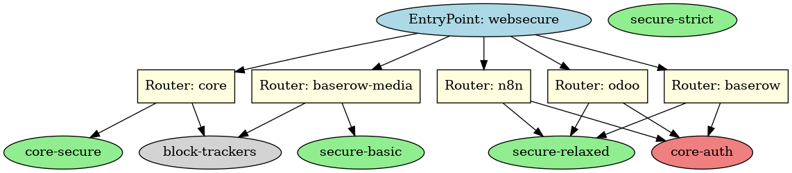

# 🧠 Traefik Dynamic Middlewares

This folder contains the modular and scalable middleware definitions for Traefik, managed via a single mounted dynamic configuration file: `middlewares.yaml`.

## 🧩 Purpose

We’ve designed this structure to:
- Isolate middleware logic per service (e.g. strict, relaxed, media).
- Apply headers, auth, CSPs, and security layers in a clean and reusable way.
- Avoid duplication using named middlewares and dynamic chaining.
- Enable fast debugging and flexible deployments for each microservice.

---

## 📐 Architecture Overview



- 🔒 `core-secure`: Strict CSP, HSTS, XSS, referrer, and permissions policies for backend auth.
- 🛡️ `secure-relaxed`: Used for frontend UIs like n8n, Odoo, Baserow — allows inline JS and cloud sources.
- 🪶 `secure-basic`: Minimal secure headers, no CSP — ideal for media or asset-only services.
- 🕵️ `block-trackers`: Blocks 3rd-party tracking via custom CSP and headers.
- 🔑 `core-auth`: ForwardAuth middleware that delegates to Core microservice for secure access validation.

---

## 📦 Middlewares Breakdown

| Middleware         | Type        | Description                                                       |
|--------------------|-------------|-------------------------------------------------------------------|
| `core-auth`        | forwardAuth | Validates requests via Core (`/security/verify-admin`)            |
| `core-secure`      | headers     | Strict policy for backend security, limited connections           |
| `secure-relaxed`   | headers     | Looser policy for UIs, allows inline and blob/script sources      |
| `secure-basic`     | headers     | No CSP, basic HSTS and frame protections                          |
| `block-trackers`   | headers     | Adds CSP to block trackers, adds `X-Blocked-By` custom header     |

---

## 🧪 Usage

In `docker-compose.yml` (example):

```yaml
labels:
  - "traefik.http.routers.core.middlewares=core-secure@file, block-trackers@file"
  - "traefik.http.routers.n8n.middlewares=core-auth@file, secure-relaxed@file"
```

> ❗ Avoid chaining middlewares via `chain:` directive if issues arise — explicit comma-separated definitions are more stable with Traefik + dynamic files.

---

## 📁 File Reference

- `middlewares.yaml`: All middleware definitions.
- `traefik_middlewares_flow.png`: Diagram showing middleware flow.

---

## 👨‍🔧 Pro Tip

Want to enforce tracking protection everywhere?

Apply `block-trackers@file` to any router serving public content.

```yaml
- "traefik.http.routers.public-site.middlewares=secure-basic@file, block-trackers@file"
```

---

## 🧼 Bonus: Keeping It Clean

We recommend using consistent naming like:
- `secure-*` for header groups
- `core-*` for authentication logic
- `block-*` for optional extra protections

---

Built with ❤️ by [LeonobiTech](https://www.leonobitech.com)